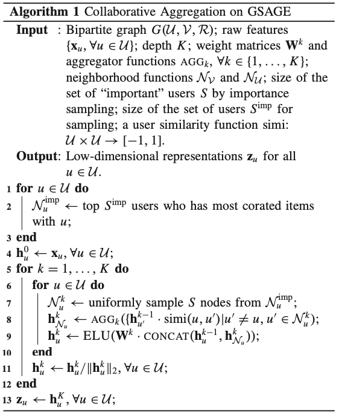
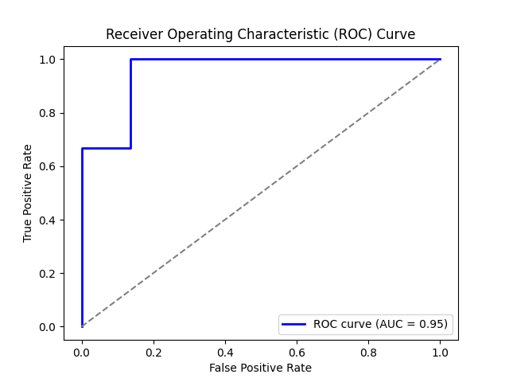
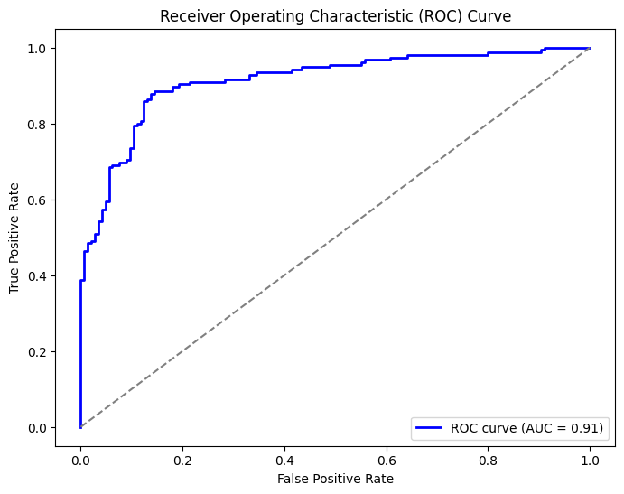
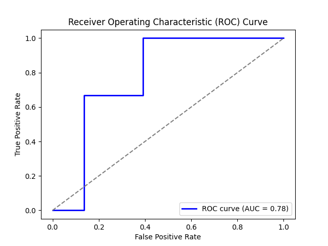

# Final Project CSDS 440: Rohan Singh

## Section 1: Survey

### 1.1 Semi-supervised Anomaly Detection on Attributed Graphs

The proposed method in this paper introduces an efficient method to detect anomalies in attribute graphs, where instances are interconnected. Unlike traditional anomaly detection methods assuming independent instances, this approach embeds connected nodes in a graph using graph convolutional networks (GCNs), considering both their attributes and structure. To address the challenge of imbalanced classes due to rare anomalies, the method trains GCN parameters to minimize a hypersphere's volume enclosing normal instances' embeddings while placing anomalous ones outside the sphere. By measuring distances between node embeddings and the hypersphere center, anomalies are identified. This method effectively spreads labeled information from a few nodes to unlabeled ones by considering attributes, graph structure, and class imbalances. 

This paper discusses existing approaches and their limitations in handling anomalies with limited labeled data. The proposed solution introduces a semi-supervised anomaly detection method for attributed graphs, leveraging graph convolutional networks (GCNs) to embed nodes in a latent space. This method effectively discriminates between normal and anomalous instances by minimizing a hypersphere's volume around normal embeddings while placing anomalous ones outside it. By utilizing differential area under the curve (AUC) loss as a regularizer, it extracts anomalous information, crucial in cases of few labeled anomalies. The method shows promise in accurately detecting anomalies in attributed graphs, outperforming various existing methods in experiments with real-world datasets.

The task revolves around estimating anomaly scores for unlabeled nodes in an attributed graph $G$. The graph consists of nodes $V$, an adjacency matrix $A$ denoting edges, and attribute vectors $X$ for each node. Anomalies are labeled as $A$, normal nodes as $N$, with a few labeled nodes given $(|A ∪ N | ≪ N)$ and a class imbalance $(|A| ≪ |N|)$. The goal is to calculate anomaly scores high for anomalies and low for normal instances based on the given labeled information.

The anomaly score $a(v_n)$ for each node is defined as the squared Euclidean distance between the learned node embedding $h_n$ and a pre-determined center $c$. This score is small when the embedding is close to $c$ and large when far away, allowing accurate detection of anomalies. Mathematically it is defined as:
$$a(v_n) := \|h_n-c\|^2$$

TThe proposed method learns node embeddings specialized for anomaly detection on the attributed graph on the basis of GCNs. The $(l+1)^{th}$ layer, $H^{(l+1)} = [h_1^{(l+1)}, \ldots, h_2^{(l+1)}]^T$ is calculated from the provious layer $H^{(l)}$ using the following propogation rule:
$$H^{(l+1)} = \sigma\left(\tilde{D}^{-\frac{1}{2}}A\tilde{D}^{-\frac{1}{2}}H^{(l)}W^{(l)}\right)$$ 
Where $W^{(l)}$ are the layers trainable weights and $\sigma$ is the activation function used.

The proposed method utilizes Graph Convolutional Networks (GCNs) to learn K-dimensional node embeddings by transforming attribute vectors through multiple layers. The objective function consists of two terms:  
1. Minimizing the volume of a hypersphere enclosing normal node embeddings ($\mathcal{L}_{nor}$). Defined as:
$$\mathcal{L}_{nor}(\theta) := \frac{1}{|\mathcal{N}|}\sum_{n \in \mathcal{N}}\|h_n - c\|^2$$
2. Employing a differential Area Under the Curve (AUC) loss to effectively use anomalous instance information ($\mathcal{R}_{AUC}$).
$$\mathcal{R}_{AUC}(\theta) := \frac{1}{|\mathcal{A}||\mathcal{N}|}\sum_{n \in \mathcal{A}}\sum_{m \in \mathcal{N}}f(a(v_n) - a(v_m))$$

The final objective function $\mathcal{L}$ is a weighted sum of $\mathcal{L}_{nor}$ and $\mathcal{R}_{AUC}$ with a hyperparameter $\lambda$ controlling the AUC loss influence. The GCN parameters are optimized by minimizing this function.
$$\mathcal{L}(\theta) := \mathcal{L}_{nor}(\theta) - \lambda\mathcal{R}_{AUC}$$

After optimizing the GCN parameters, the anomaly score for an unlabeled instance $a(v^*)$ is computed as the squared Euclidean distance between its embedding and the predetermined center $c$. The proposed method can be extended from transductive to inductive using inductive variants of Graph Neural Networks (GNNs) to estimate scores for unobserved instances at training time.

### 1.2 A Synergistic Approach for Graph Anomaly Detection With Pattern Mining and Feature Learning (PAMFUL)
This paper adresses anomaly detection in biparite graphs, using there proposed method PAMFUL. This approach merges Pattern Mining and Feature Learning for graph anomaly detection by leveraging global structural patterns. PAMFUL integrates three key components: a GNN encoder for feature learning from the graph's attributed structure, a pattern mining-based anomaly detection algorithm capturing global patterns, and an error-bounded distribution-aware margin loss function. This synergy allows PAMFUL to fuse global structural insights derived from pattern mining into the GNN encoder's feature learning, enabling the learned node representations to embody both local and global context for enhanced anomaly detection.

One standout aspect of PAMFUL is its adaptability, accommodating various GNN encoders (e.g., GCN, GAT, GRAPHSAGE) and unsupervised graph anomaly detection methods (individual or group detection). Furthermore, during training, PAMFUL emphasizes large margins for minority classes, improving generalization on predicting minority groups, which is theoretically supported by a proven bound on prediction error. The approach showcases effectiveness by capturing global structural patterns where traditional methods based on random walk assumptions fall short. Experimental validation across diverse real-world datasets demonstrates the superior performance of GNN algorithms trained via PAMFUL over existing methods, highlighting its efficacy, generalizability, and theoretically guaranteed performance in handling imbalanced data.

The framework employs GNN encoders for feature learning in bipartite graphs, where the conventional assumption of related information among neighboring nodes doesn't apply due to nodes being of different types. Specifically, in the context of rating behaviors within bipartite graphs, the approach avoids aggregating embeddings from different node types. For instance, when generating user embeddings, instead of combining item embeddings into the user representation, the focus shifts to aggregating information from other users who share common neighboring items.

Given the large number of secondary neighbors (users with corated items), the aggregation process prioritizes users based on the similarity or dissimilarity of their behavioral patterns. This user–user similarity function $(simi(u,u′))$ becomes crucial in the aggregation process, shaping how information is gathered and incorporated into the embeddings in a bipartite graph context. The method relies on two user similarity measures commonly used in user-based collaborative filtering techniques.

The cosine similarity measures the similarity between the rating distributions of $u$ and $u′$ over a set of for the set of corated items by $u$ and $u′$ ($\mathcal{V}$), in an inner product space given by the forumula:
$$simi(u,u')^{\text{COS}} = \frac{\sum_{v \in \mathcal{V}}r_{u,v}\cdot r_{u',v}}{\sqrt{\sum_{v \in \mathcal{V}}r^2_{u,v} \sum_{v \in \mathcal{V}}}r^2_{u',v}}$$

After using the Bipartite Encoding techniques, the proposed method makes use of pattern mining algorithms. These algorithms take the graph structure as input and output the global pattern role of each user nodes. Individual Anomaly Detection Algorithms assign binary labels to nodes unsupervisedly for a given graph. The paper defines some of the existing algorithms for the same which calculate the suspiciossness score of nodes.  

These suspiciousness scores are measured based on the type of algorithm, which can be classified into:  
  - Feature-Based Graph Anomaly Detection: These meth-
ods define the suspiciousness score of node $u$ based on a pair of its particular features $a_u$ and $b_u$.
  - Structure-Based Graph Anomaly Detection: These methods define the suspiciousness score using the graph structure. They assume that the majority of users have low suspiciousness score. Then users with high suspiciousness scores can be reported as anomalies.
  - Model-Based Graph Anomaly Detection: The idea behind these methods is that the majority of the graphs, or say, the structural dependence, can be learned by a specific graph model

This is the general algorithm for the implementation of the proposed method of Pattern Mining and Feature Learning (PAMFUL) for graph anomaly detection given in A Synergistic Approach for Graph Anomaly Detection With Pattern Mining and Feature Learning.  

### 1.3 Spectral Autoencoder for Anomaly Detection in Attributed Networks
This paper addresses anomaly detection in attributed networks, where instance dependencies and interactions are present. It introduces SpecAE, a framework based on spectral convolution and deconvolution techniques. SpecAE customizes the network projection to identify both global and community anomalies by enhancing the differences between representations of anomalies and majority instances. It combines learned representations and reconstruction errors with density estimation for detection, training them simultaneously in an end-to-end manner. Real-world experiments showcase SpecAE's effectiveness in detecting anomalies in attributed networks.

The proposed anomaly detection framework, SpecAE, targets attributed networks by leveraging tailored Spectral autoencoders to embed nodal attributes and relations into a unified space. This framework consists of two primary components for anomaly detection: global anomalies and community anomalies. 

It involves an autoencoder applied to nodal attributes (X) to learn two types of tailored representations: $Z_X$ for embedding nodal attributes and ${Z_{Xerror}}$ to capture reconstruction errors. The equations $Z_X = \sigma(b_e + XW_e)$ and $\hat{X} = \sigma(b_d + Z_XW_d)$ illustrate the encoding and decoding processes. Here, $Z_X$ represents the learned embeddings of nodal attributes, while $\hat{X}$ signifies the reconstructed nodal attributes. The $Z_{Xerror}$ calculation using $dis(X,\hat{X})$ quantifies the difference between the original and reconstructed attributes, aiding in identifying global anomalies.

The second component focuses on community anomalies by employing graph convolutional networks (GCN) to learn nodes’ community representations ($Z_G$) based on their neighboring nodes. The equation 
$$Y = \tilde{D}^{-\frac{1}{2}}\tilde{A}\tilde{D}^{-\frac{1}{2}}X$$ 
represents the smoothing operation in GCN, where \(Y\) denotes the transformed feature matrix. However, GCN lacks nodal attribute reconstruction, which is crucial for anomaly detection. To address this, the paper introduces a graph deconvolution process as an inverse operation to graph convolution. It aims to restore nodal attributes from the smoothed features by sharpening the representations obtained through the convolution process.

The convolutional layer's propagation rule 
$$\text{Conv}(X,A) = \sigma\left((1-\alpha)X+\alpha\tilde{D}^{-\frac{1}{2}}\tilde{A}\tilde{D}^{-\frac{1}{2}}X\right)W_f$$ 
showcases the combination of the input nodal attributes with the smoothed features using activation functions and trainable weights ($W_f$). This process balances the information from the original attributes and the neighborhood information encoded in the spectral domain.

The objective function for an input attributed graph $\mathcal{G} = \{A,X\}$, $J(W)$ contains a function for the reconstruction error, GMM estimation and regulaizer (to penalize small values), represented mathematically by the equation:
$$J(W) = \mathbb{E}[dis(X,\hat{X})] + \mathbb{E}[dis(X,\tilde{X})] + \lambda_1\mathbb{E}(E(Z)) \\+ \lambda_2\sum_{i=1}^K\sum_{j=1}^d\frac{1}{\hat{\Sigma}_{ij}}-\mathcal{KL}[f(Z_{\mathcal{G}}|X,A)||g(Z_{\mathcal{G}})] \\+
\mathbb{E}_{f(Z_{\mathcal{G}}|X,A)}log(g(\tilde{X}|Z_{\mathcal{G}},A))$$
After optimizing the objective function above, the proposed approach can be applied to detect anomalous to the given attributed network.

In summary, SpecAE introduces a comprehensive approach to anomaly detection in attributed networks by employing tailored spectral autoencoders for global anomaly identification and integrating graph convolution and deconvolution to capture community anomalies. The fusion of these techniques aims to create a robust anomaly detection framework capable of identifying diverse types of anomalies in complex attributed networks.

## Section 2: Methods
**Note:** The python code for these method as well as its supporting readme file can be found in the "code" folder. 
### 2.1 Semi-supervised Anomaly Detection on Attributed Graphs
As described previously in detail in the survey section of this report. The proposed method used the normalized node embeddings ($\mathcal{L_{nor}}$) and the differential area under curve ($\mathcal{R}_{AUC}$) as the objective fucntion and used the generalized Graph Convulational network Propogation rule.  

To run the porposed method I had to implement the following rules and mathematical functions in Python:  
  1. Propogation rule:
  $$H^{(l+1)} = \sigma\left(\tilde{D}^{-\frac{1}{2}}A\tilde{D}^{-\frac{1}{2}}H^{(l)}W^{(l)}\right)$$ 
  2. Normal Node Embedding:
  $$\mathcal{L}_{nor}(\theta) := \frac{1}{|\mathcal{N}|}\sum_{n \in \mathcal{N}}\|h_n - c\|^2$$
  3. Differential Area under Curve:
  $$\mathcal{R}_{AUC}(\theta) := \frac{1}{|\mathcal{A}||\mathcal{N}|}\sum_{n \in \mathcal{A}}\sum_{m \in \mathcal{N}}f(a(v_n) - a(v_m))$$
  4. Final Objective Function:
  $$\mathcal{L}(\theta) := \mathcal{L}_{nor}(\theta) - \lambda\mathcal{R}_{AUC}$$

To implement and train the model, I used PyTorch to define the GCN class and implemented an early stopping mechanism to prevent overfitting.  

The Dataset used in my implementation and training python module is the cora dataset as that dataset can be run on the graders personal computer in very little time and doesn't require high comutational resources.

## Section 3: Research Extension
My research extension in the field of anomaly detection in graph based models is to introduce the ***Laplacian matrix*** $L$ of the graph $\mathcal{G}$ during its training phase instead of the Adjacency matrix $A$ of the graph. The Laplacian matrix of a graph is defined as the difference between the degree matrix $D$ of the graph and the adjacency matrix $A$. The graph Laplacian matrix can be viewed as a matrix form of the negative discrete Laplace operator on a graph approximating the negative continuous Laplacian obtained by the finite difference method. 

Mathematically, the diagonal matrix $D$ is defined as:
$$D_{ij} := \begin{cases}deg(v_i) \ \quad \ \text{if $i=j$}\\0 \ \quad \quad \quad \ \ \ \text{if $i \neq j$} \end{cases}$$
And the Laplacian matrix is given by:
$$L_{ij} = \begin{cases}deg(v_i) \ \ \quad \text{if $i=j$}\\-1 \quad \quad \quad \  \text{if $i \neq j$ and if $v_i$ is adjacent to $v_j$}\\0 \quad \quad \quad \quad \text{otherwise}\end{cases}$$
or equivalently in matrix form as,
$$L=D-A$$

Employing Laplacian matrices for anomaly detection using GCN and Semi-GCN could improve the models as Laplacian matrices carry more information about the properties about the graphs that simply using adjacency matrices don't. This is because the vertex degree information is missing in adjacency matrices.

The way I incorporated Laplacian Matrices in the learning process of Semi-supervised Anomaly Detection on Attributed Graphs, was by changing the propogation rule of the the $(l+1)^{th}$ layer to:
$$H^{(l+1)} = \sigma\left(\tilde{D}^{-\frac{1}{2}}L\tilde{D}^{-\frac{1}{2}}H^{(l)}W^{(l)}\right)$$ 

Further use of Laplacian matrices can be the use of spectral decomposition of the Laplacian matrix, which can allows constructing low dimensional embeddings that can be used in providing spectral layouts in graph drawings and anomaly detection. 

**Note:** The Python implementation of my research extension is present in the code folder as well.

## Section 4: Results analysis and discussion

### 4.1 Semi-supervised Anomaly Detection on Attributed Graphs
I ran the implementation of the proposed method from Semi-supervised Anomaly Detection on Attributed Graphs on two datasets. One of them was the Cora dataset that the paper used and was publicly available. The other being the YelpRes dataset, which I used so that I could compare it with my project group. The metric that I chose for measuring the performance of the proposed method was the area under the ROC curve and the results were as follows for each of the datasets.

This plot shows the area under the ROC curve for the Cora dataset. The area under ROC under the proposed method was found to be 0.95

This plot shows the area under the ROC curve for the YelpRes dataset. The area under ROC under the proposed method was found to be 0.91

### 4.2 Research Extension
I ran the implementation of my research extension on the proposed method from Semi-supervised Anomaly Detection on Attributed Graphs on  the Cora dataset that the paper used and was publicly available. I once again chose area under the ROC curve as the metric to compare it with the original method.

This plot shows the area under the ROC curve for the Cora dataset. The area under ROC under the proposed method was found to be 0.78

### 4.3 Analysis and Conclusion
The results from the Semi-supervised Anomaly Detection on Attributed Graphs on the Cora Dataset performed better than my proposed research extension of using Laplacian Matrices for the propogation rule. The research extension however, still produced good results in comparison to other anomaly detection methods that were provided in the seed paper for anomaly detection.

The reason why I believe that my research extension showed some promise in terms of anomaly detection was because the diagonal entries of the Laplacian Matrices store a lot more meaningful data about the nodes of the graph especially in terms of connectivity, something that adjacency matrices don't take advantage of. Hence, this makes it easier to detect anomalies. However, the reason why it didn't perform as well as some of the propsed methods of anomaly detections, was because the Loss Functions that I used were designed for algorithms that use adjacency matrices and are hence suited for those problems. Developing more specialized loss functions suited for learning from Laplacian Matrices might improve the performance of my research extension in the future.

In conclusion, the proposed method performed really well with respect to most other baseline methods for anomaly detection. With the Laplacian propogation rule still requiring some more room for improvement.

## Bibliography
For this report I used the following papers:  
  [1] Kumagai, Atsutoshi, Tomoharu Iwata, and Yasuhiro Fujiwara. "Semi-supervised anomaly detection on attributed graphs." 2021 International Joint Conference on Neural Networks (IJCNN). IEEE, 2021.  
  [2] Zhao, Tong, et al. "A synergistic approach for graph anomaly detection with pattern mining and feature learning." IEEE Transactions on Neural Networks and Learning Systems 33.6 (2021): 2393-2405.    
  [3] Li, Yuening, et al. "Specae: Spectral autoencoder for anomaly detection in attributed networks." Proceedings of the 28th ACM international conference on information and knowledge management. 2019.   
  [4] Kim, Hwan, et al. "Graph anomaly detection with graph neural networks: Current status and challenges." IEEE Access (2022).

